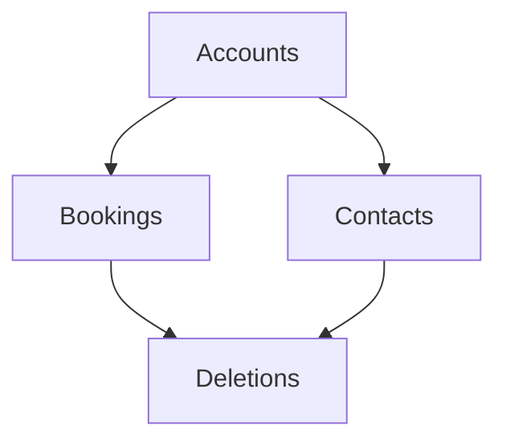

# Hand-written documentation

Documentation in the articles section is either manually-written or generated by some external tool (e.g. [markdown-maker](https://github.com/Cloud-Awesome/markdown-maker))

## Title 1

Lorem ipsum dolor sit amet, consectetuer adipiscing elit. Maecenas porttitor congue massa. Fusce posuere, magna sed pulvinar ultricies, purus lectus malesuada libero, sit amet commodo magna eros quis urna.

Nunc viverra imperdiet enim. Fusce est. Vivamus a tellus.

> [!WARNING]
> Be careful with this one!

Pellentesque habitant morbi tristique senectus et netus et malesuada fames ac turpis egestas. Proin pharetra nonummy pede. Mauris et orci.

## Title 2

Aenean nec lorem. In porttitor. Donec laoreet nonummy augue.

Suspendisse dui purus, scelerisque at, vulputate vitae, pretium mattis, nunc. Mauris eget neque at sem venenatis eleifend. Ut nonummy.

Fusce aliquet pede non pede. Suspendisse dapibus lorem pellentesque magna. Integer nulla.

Lorem ipsum dolor sit amet, consectetuer adipiscing elit. Maecenas porttitor congue massa. Fusce posuere, magna sed pulvinar ultricies, purus lectus malesuada libero, sit amet commodo magna eros quis urna.

> [!TIP]
> The below diagram is generated using [mermaid](https://mermaid-js.github.io/mermaid/#/). Some of the boxes are clickable to take the reader to more detailed information.

## Title 3

Nunc viverra imperdiet enim. Fusce est. Vivamus a tellus.

Pellentesque habitant morbi tristique senectus et netus et malesuada fames ac turpis egestas. Proin pharetra nonummy pede. Mauris et orci.

Aenean nec lorem. In porttitor. Donec laoreet nonummy augue.

## Title 4

Suspendisse dui purus, scelerisque at, vulputate vitae, pretium mattis, nunc. Mauris eget neque at sem venenatis eleifend. Ut nonummy.

Fusce aliquet pede non pede. Suspendisse dapibus lorem pellentesque magna. Integer nulla.

> [!IMPORTANT]
> At the bottom of this page you can see examples of:
> - This site exported to a PDF
> - See also links
> - A list of page contributors, which can be linked to the contributors site (e.g. blog, Twitter handle, Github profile, or even a mailto link. Anything which is URL addressable...)

## Download to PDF

[Download docs_articles.pdf](../../downloads/docs_articles.pdf)